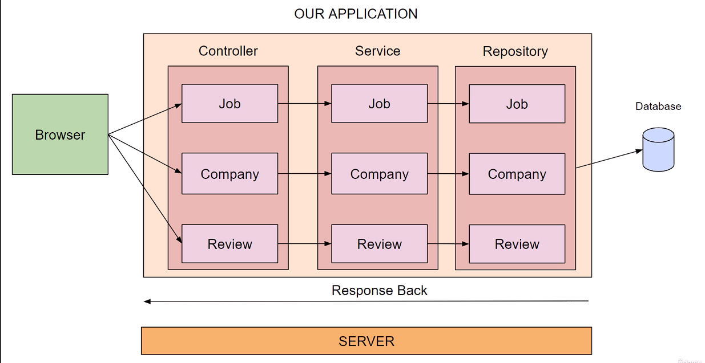

# Job-Application
A basic job review application using spring boot. This application uses MVC architecture i.e It has model/entity, view and controller.
The user can create a job, company, reviews. It has controller where all the endpoints are defined, service layer where all the logic is been written 
and the repository layer is for the CRUD operations to be performed on database. 

### Entity
1. Job
2. Company
3. Review

### Tech Used
1. Java (jdk 17) spring boot 
2. H2 database
3. JPA
4. Actuators
5. Docker

### EndPoints
JOB :
1. findAll() - to getAll the jobs
2. getJobById(Long id) - to get the job by specific id
3. updateJob(Long id, Job job) - to update the specific job by id
4. createJob(Job job) - to create a new job

Company :
1. findAll() - to getAll the companies
2. getCompanyById(Long id) - to get the company by specific id
3. updateCompany(Long id, Company company) - to update the specific company by id
4. createCompany(Company company) - to create a new company

Reviews :
1. findAll() - to getAll the reviews
2. getReviewById(Long id) - to get the review by specific id
3. updateReview(Long id, Review review) - to update the specific review by id
4. createReview(Review review) - to create a new review

Find all the postman URL 👉🏻 https://documenter.getpostman.com/view/20104625/2sA35BbPjk
